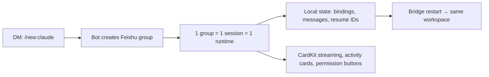

<div align="center">

# agents-to-im

### AI coding agents are trapped in your terminal. Your team collaborates in Feishu. This bridges them — one group per session, local state, streamed cards.

[](LICENSE)
[](https://nodejs.org/)
[](https://docs.anthropic.com/en/docs/claude-code)
[](https://github.com/openai/codex)

[中文文档](README.zh-CN.md) · [Setup Guide](references/setup-guides.md) · [Troubleshooting](references/troubleshooting.md)

</div>

---

> [!IMPORTANT]
> **What it touches:** Creates config and state under `~/.agents-to-im/` (sessions, bindings, message history). Runs as a local daemon under your user account.
>
> **Network:** Connects outbound to Feishu/Lark APIs only. No inbound listeners are opened.
>
> **Credentials:** Stored in `~/.agents-to-im/config.env` with `600` permissions. Secrets are masked in all log output.
>
> **Disable:** `agents-to-im stop`
>
> **Uninstall:** `rm -rf ~/.agents-to-im`

```bash
npm install -g agents-to-im
agents-to-im onboard   # choose language first, then follow the guided platform setup step by step
```

---

> [!NOTE]
> **Project origin:** `agents-to-im` started from [Claude-to-IM-skill](https://github.com/op7418/Claude-to-IM-skill) and has since been renamed and substantially reworked.
> A backup of the pre-rewrite history is kept on the `legacy/upstream-history` branch for provenance.

## The Problem

Claude Code and Codex are excellent coding agents — but they only talk to you in the terminal. If your team lives in Feishu/Lark, there's no clean way to bring that capability into your IM workspace without mixing sessions into a noisy shared thread.

Most terminal-to-chat relays treat the chat window as the session container. That means no isolation, no recovery after restarts, and Feishu gets reduced to a plain-text command relay.

`agents-to-im` takes a different approach: DM is the control plane, each `/new:claude` or `/new:codex` creates a dedicated Feishu group bound to exactly one session and one runtime. State lives locally, so the workspace survives bridge restarts.

---

## See It Work

```
You → DM bot: /new:claude

Bot → Creates a new Feishu group "Claude Workspace"
Bot → Shows mode selection card (Code / Plan / Ask)
You → Pick "Code", choose workspace ~/my-project

Bot → Group created, session bound
Bot → "How can I help with ~/my-project?"

You → (in group) Fix the login redirect bug in auth.ts

Bot → [Streaming card with live progress]
Bot → [Activity card: editing src/auth.ts]
Bot → [Permission card: Allow file write?] [Allow] [Deny]
Bot → Done. Fixed the redirect loop in handleCallback().

You → /stop                    # interrupt current output
You → /reset                   # fresh session, same group
You → /mode                    # switch Claude mode
```

---

## Install

### Recommended: Install from npm

```bash
npm install -g agents-to-im
agents-to-im onboard
```

`onboard` now starts with a language picker, uses `↑/↓` + `Enter` for every choice, asks before copying scopes JSON or opening Feishu pages, and waits for you to press Enter after each platform step is actually done.

Use `agents-to-im ...` for daily operation:

```bash
agents-to-im onboard      # run onboarding explicitly
agents-to-im start        # start the daemon
agents-to-im stop         # stop the daemon
agents-to-im restart      # restart after config changes
agents-to-im status       # check if running
agents-to-im doctor       # diagnose common issues
agents-to-im upgrade      # upgrade the local service and restart if it is running
agents-to-im logs 200     # view recent logs
```

<details>
<summary><b>Alternative: Source checkout</b> (for development/debugging)</summary>

```bash
git clone https://github.com/francize/agents-to-im.git
cd agents-to-im
npm install
npm run build:all

mkdir -p ~/.agents-to-im
cp config.env.example ~/.agents-to-im/config.env
$EDITOR ~/.agents-to-im/config.env

bash scripts/daemon.sh restart
```

</details>

---

## Getting Started

### Prerequisites

- Node.js 20+
- A Feishu/Lark custom app with Bot enabled ([setup guide](references/setup-guides.md))
- Claude Code CLI and/or Codex CLI installed and authenticated locally

### 1. Create and configure your Feishu/Lark app

1. Create a custom app at [Feishu](https://open.feishu.cn/app) or [Lark](https://open.larksuite.com/app)
2. Enable the **Bot** capability
3. Import the full scopes JSON from [references/setup-guides.md](references/setup-guides.md) in one shot
4. Publish one app version first
5. After the local bridge is running, switch `Events & Callbacks` to **Long Connection**
6. Add `im.message.receive_v1`, `im.message.message_read_v1`, `im.chat.updated_v1`, and `im.chat.member.bot.added_v1`
   `im.chat.updated_v1` is required if you want manual group-name edits to sync back into Codex threads or Claude sessions.
7. Add the `card.action.trigger` callback
8. Publish again so events and callbacks go live
9. Optional: add `/new:claude` and `/new:codex` to the Bot floating menu

### 2. Configure the bridge

```bash
mkdir -p ~/.agents-to-im
cp config.env.example ~/.agents-to-im/config.env
$EDITOR ~/.agents-to-im/config.env
```

Minimal config (single bot):

```env
CTI_FEISHU_APP_ID=cli_xxx
CTI_FEISHU_APP_SECRET=xxx
CTI_DEFAULT_WORKDIR=/path/to/your/project
```

<details>
<summary><b>All configuration options</b></summary>

| Variable | Required | Description |
|----------|----------|-------------|
| `CTI_DEFAULT_WORKDIR` | Yes | Default working directory for new sessions |
| `CTI_FEISHU_APP_ID` | Yes | Feishu app ID |
| `CTI_FEISHU_APP_SECRET` | Yes | Feishu app secret |
| `CTI_FEISHU_DOMAIN` | No | `lark` for Lark international |
| `CTI_FEISHU_ALLOWED_USERS` | No | Comma-separated allowed user IDs |
| `CTI_FEISHU_SHOW_TOOL_CALL_CARDS` | No | Set to `true` to show tool-call activity cards in group sessions. Defaults to `false`; normal assistant cards stay enabled. |
| `CTI_CLAUDE_CODE_EXECUTABLE` | No | Explicit Claude CLI path override. On Windows, npm-installed `claude.cmd` is accepted and mapped to the real CLI entry automatically. |

Claude and Codex both use the local CLI defaults on the host machine for model selection and approvals. Codex sessions reuse your local `~/.codex/config.toml` for auth, trusted directories, sandbox, and approval policy.
If you install or update Claude Code after the bridge has already started, restart the bridge so the daemon picks up the new CLI path and environment.

</details>

### 3. Start and verify

```bash
agents-to-im start
agents-to-im doctor        # check for common issues
agents-to-im status        # confirm the bridge is running
```

Open `http://127.0.0.1:13578` to access the local dashboard, then DM the bot with `/new:claude` or `/new:codex`.

---

## How It Works

DM is the control plane. Each `/new:*` command creates a fresh Feishu group bound to one session and one runtime. Local JSON state keeps the workspace recoverable across bridge restarts.



<details>
<summary><b>Feishu-native interactions</b></summary>

| Interaction | Behavior |
|-------------|----------|
| Streaming preview | CardKit first, falls back to interactive-card patching, then plain text |
| Permission handling | Inline buttons on approval cards; `1/2/3` quick reply only works when exactly one request is pending |
| Activity visibility | Command/file/plan progress rendered as cards |
| Structured input | Runtime follow-ups rendered as Feishu cards; sensitive prompts redirected to local CLI |
| Group naming | Auto-renamed after first successful turn; Claude mode appended as suffix |

</details>

<details>
<summary><b>State and recovery</b></summary>

All state lives under `~/.agents-to-im/`:

| Path | Contents |
|------|----------|
| `data/sessions.json` | Session metadata, runtime, model, title, resume IDs |
| `data/bindings.json` | Group-to-session bindings, workdir, mode, model routing |
| `data/messages/` | Persisted message history per session |
| `runtime/status.json` | Bridge run status and last exit reason |
| `runtime/bridge.pid` | Active daemon PID |

What survives a bridge restart:
- Group-to-session binding
- Runtime choice (Claude or Codex)
- Message history
- Resume identifiers for continuing the underlying session
- `/reset` creates a fresh session in the same group

</details>

---

## Commands

### DM (control plane)

| Command | Description |
|---------|-------------|
| `/new:claude` | Select a workspace and Claude mode, then create a dedicated group |
| `/new:codex` | Select a workspace, then create a dedicated Codex group |
| `/resume:claude` | Resume a recent Claude session in a new group |
| `/resume:codex` | Resume a recent Codex session in a new group |

Any other DM message returns help text.

### In a bound group

| Command | Description |
|---------|-------------|
| *(message)* | Continue the current session |
| `/mode` | Switch Claude mode (card) or Codex bridge mode (`/mode plan\|code\|ask`) |
| `/plan` | Start interactive planning; `/plan <request>` to plan immediately |
| `/stop` | Interrupt current output (equivalent to `Esc` in terminal) |
| `/reset` | Fresh session, same group and runtime |

---

## FAQ

**Can I use both Claude and Codex with the same bot?**
Yes. The bridge now assumes a single Feishu/Lark bot and routes Claude/Codex per session behind that bot.

**What happens if the bridge restarts?**
Your groups, session bindings, and message history are preserved locally. Send a message in the group to continue where you left off.

**Is my code sent to Feishu servers?**
The bridge streams AI-generated text and activity summaries to Feishu. Your source code stays local — only the agent's output and your messages transit through the Feishu API.

---

## Acknowledgements

Special thanks to [op7418/Claude-to-IM-skill](https://github.com/op7418/Claude-to-IM-skill).

This project was inspired by that work, and this repository is a Feishu/Lark-focused second-pass vibe built on top of that inspiration.

---

## Troubleshooting

| Symptom | First step |
|---------|------------|
| Bridge won't start | `agents-to-im doctor` |
| Bot doesn't reply to DM | Check app is published, Bot enabled, Long Connection configured |
| `/new:*` creates group but fails to bind | Check app scopes and local runtime availability |
| Cards fall back to plain text | Verify CardKit and message update permissions |
| Permission buttons don't respond | Verify `card.action.trigger` is configured and app version published |

Full troubleshooting guide: [references/troubleshooting.md](references/troubleshooting.md)

---

## Contributing

Contributions are welcome. See [CONTRIBUTING.md](CONTRIBUTING.md) for guidelines.

```bash
npm install
npm run typecheck
npm test
npm run build:all
```

## License

[MIT](LICENSE)
