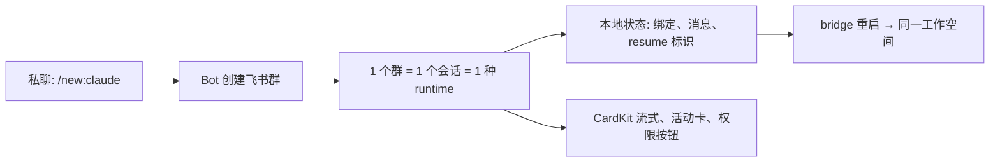

<div align="center">

# agents-to-im

### AI 编码代理困在你的终端里，团队却在飞书协作。这个项目把它们桥接起来 — 每个群一个会话，本地状态，流式卡片。

[](LICENSE)
[](https://nodejs.org/)
[](https://docs.anthropic.com/en/docs/claude-code)
[](https://github.com/openai/codex)

[English](README.md) · [配置指南](references/setup-guides.md) · [故障排查](references/troubleshooting.md)

</div>

---

> [!IMPORTANT]
> **它动了什么：** 在 `~/.agents-to-im/` 下创建配置和状态文件（会话、绑定、消息历史）。以本地 daemon 方式运行在你的用户账号下。
>
> **网络：** 只向飞书/Lark API 发起出站连接，不开放任何入站监听端口。
>
> **凭据：** 存储在 `~/.agents-to-im/config.env`，文件权限 `600`。所有日志输出中的密钥均已脱敏。
>
> **停用：** `agents-to-im stop`
>
> **卸载：** `rm -rf ~/.agents-to-im`

```bash
npm install -g agents-to-im
agents-to-im onboard   # 先选中文/英文，再按步骤引导权限、事件、回调和发布
```

---

> [!NOTE]
> **项目来源：** `agents-to-im` 最初基于 [Claude-to-IM-skill](https://github.com/op7418/Claude-to-IM-skill) 演进而来，之后经历了重命名和较大规模重构。
> 为了保留来源证据，历史重写前的完整提交链会保存在 `legacy/upstream-history` 分支。

## 解决什么问题

Claude Code 和 Codex 是优秀的编码代理 — 但它们只在终端里和你对话。如果你的团队在飞书/Lark 上协作，没有一种干净的方式把这种能力带进 IM 工作空间，而不是把所有会话混进一个嘈杂的群聊线程里。

常见的终端到聊天工具转发方案把聊天窗口直接当作会话容器 — 没有隔离、重启后无法恢复、飞书被降级为纯文本命令转发器。

`agents-to-im` 采用不同的方式：私聊是控制面，每次 `/new:claude` 或 `/new:codex` 都会创建一个专属飞书群，绑定唯一的会话和 runtime。状态保存在本地，工作空间在 bridge 重启后依然可用。

---

## 看看效果

```
你 → 私聊 Bot: /new:claude

Bot → 创建新飞书群 "Claude 工作空间"
Bot → 弹出模式选择卡片 (Code / Plan / Ask)
你 → 选择 "Code"，选择工作目录 ~/my-project

Bot → 群创建完毕，会话已绑定
Bot → "需要我帮你处理 ~/my-project 中的什么问题？"

你 → (在群里) 修复 auth.ts 中的登录重定向 bug

Bot → [流式卡片，实时显示进度]
Bot → [活动卡片：正在编辑 src/auth.ts]
Bot → [权限卡片：允许写入文件？] [允许] [拒绝]
Bot → 完成。已修复 handleCallback() 中的重定向循环。

你 → /stop                    # 中断当前输出
你 → /reset                   # 新会话，保留当前群
你 → /mode                    # 切换 Claude 模式
```

---

## 安装

### 推荐：通过 npm 安装

```bash
npm install -g agents-to-im
agents-to-im onboard
```

`onboard` 现在会优先让你选择中文或英文；所有选择题都支持 `↑/↓` 和 `Enter`；复制 scopes JSON、打开飞书页面前都会先确认，每一步做完后再按回车继续。

后续统一通过 `agents-to-im ...` 管理 daemon：

```bash
agents-to-im onboard      # 显式运行引导
agents-to-im start        # 启动 daemon
agents-to-im stop         # 停止 daemon
agents-to-im restart      # 配置变更后重启
agents-to-im status       # 检查运行状态
agents-to-im doctor       # 诊断常见问题
agents-to-im upgrade      # 升级本地服务并在运行中时重启 bridge
agents-to-im logs 200     # 查看最近日志
```

<details>
<summary><b>备选：源码安装</b>（用于开发/调试）</summary>

```bash
git clone https://github.com/francize/agents-to-im.git
cd agents-to-im
npm install
npm run build:all

mkdir -p ~/.agents-to-im
cp config.env.example ~/.agents-to-im/config.env
$EDITOR ~/.agents-to-im/config.env

bash scripts/daemon.sh restart
```

</details>

---

## 快速开始

### 前置条件

- Node.js 20+
- 一个开启了 Bot 能力的飞书/Lark 自建应用（[配置指南](references/setup-guides.md)）
- 本地已安装并认证 Claude Code CLI 和/或 Codex CLI

### 1. 创建并配置飞书/Lark 应用

1. 在[飞书开放平台](https://open.feishu.cn/app)或 [Lark](https://open.larksuite.com/app) 创建自建应用
2. 开启 **Bot** 能力
3. 使用 [references/setup-guides.md](references/setup-guides.md) 中的完整 scopes JSON 一次性导入权限
4. 先发布一次应用版本
5. 本地启动 bridge 后，再去 `Events & Callbacks` 切到**长连接**
6. 添加事件 `im.message.receive_v1`、`im.message.message_read_v1`、`im.chat.updated_v1`、`im.chat.member.bot.added_v1`
   `im.chat.updated_v1` 用于把用户手动修改的群名回写到 Codex thread 或 Claude session。
7. 添加回调 `card.action.trigger`
8. 再发布一次应用版本
9. 可选：在 Bot 菜单里添加 `/new:claude` 和 `/new:codex` 悬浮菜单

### 2. 配置 bridge

```bash
mkdir -p ~/.agents-to-im
cp config.env.example ~/.agents-to-im/config.env
$EDITOR ~/.agents-to-im/config.env
```

单 Bot 最小配置：

```env
CTI_FEISHU_APP_ID=cli_xxx
CTI_FEISHU_APP_SECRET=xxx
CTI_DEFAULT_WORKDIR=/path/to/your/project
```

<details>
<summary><b>所有配置项</b></summary>

| 变量 | 必填 | 说明 |
|------|------|------|
| `CTI_DEFAULT_WORKDIR` | 是 | 新会话的默认工作目录 |
| `CTI_FEISHU_APP_ID` | 是 | 飞书 App ID |
| `CTI_FEISHU_APP_SECRET` | 是 | 飞书 App Secret |
| `CTI_FEISHU_DOMAIN` | 否 | 国际版填 `lark` |
| `CTI_FEISHU_ALLOWED_USERS` | 否 | 逗号分隔的允许用户 ID |
| `CTI_FEISHU_SHOW_TOOL_CALL_CARDS` | 否 | 设为 `true` 后在群会话里展示 tool 调用活动卡片，包括 MCP/工具、命令执行和文件修改卡片。默认 `false`，普通助手消息卡片始终保留。 |
| `CTI_CLAUDE_CODE_EXECUTABLE` | 否 | 显式指定 Claude CLI 路径。Windows 下接受 npm 安装出来的 `claude.cmd`，bridge 会自动映射到真实 CLI 入口。 |

Claude 和 Codex 的默认模型、审批策略都直接由本机 CLI 自己决定。Codex 会话直接复用本地 `~/.codex/config.toml` 中的认证、trusted 目录、sandbox 和审批策略。
如果 bridge 启动之后你才安装或更新 Claude Code，需要重启 bridge，让 daemon 重新读取新的 CLI 路径和环境。

</details>

### 3. 启动并验证

```bash
agents-to-im start
agents-to-im doctor        # 检查常见问题
agents-to-im status        # 确认 bridge 正在运行
```

打开 `http://127.0.0.1:13578` 访问本地状态面板，然后私聊 Bot 发送 `/new:claude` 或 `/new:codex`。

---

## 工作原理

私聊是控制面。每条 `/new:*` 命令会创建一个新飞书群，绑定唯一的会话和 runtime。本地 JSON 状态保证工作空间在 bridge 重启后可恢复。



<details>
<summary><b>飞书原生交互</b></summary>

| 交互方式 | 行为 |
|----------|------|
| 流式预览 | 优先 CardKit，降级为 interactive-card patch，最后退到普通文本 |
| 权限处理 | 以审批卡片按钮为主；仅当群里恰好只有一个待处理请求时，`1/2/3` 可作为快捷回复 |
| 活动可见性 | 命令/文件/计划进度以卡片呈现 |
| 结构化提问 | Runtime 后续问题渲染为飞书卡片；敏感输入退回本地 CLI |
| 群命名 | 首轮成功后自动重命名；Claude 非默认模式追加后缀如 `[Plan Mode]` |

</details>

<details>
<summary><b>状态与恢复</b></summary>

所有状态保存在 `~/.agents-to-im/`：

| 路径 | 内容 |
|------|------|
| `data/sessions.json` | 会话元数据、runtime、model、标题、resume 标识 |
| `data/bindings.json` | 群到会话的绑定、工作目录、模式、模型路由 |
| `data/messages/` | 按会话持久化的消息历史 |
| `runtime/status.json` | bridge 运行状态和最近退出原因 |
| `runtime/bridge.pid` | 当前 daemon PID |

bridge 重启后保留的内容：
- 群与会话的绑定关系
- Runtime 选择（Claude 或 Codex）
- 消息历史
- Resume 标识（支持续上同一底层会话）
- `/reset` 在同一个群里创建全新会话

</details>

---

## 命令

### 私聊（控制面）

| 命令 | 说明 |
|------|------|
| `/new:claude` | 选择工作目录和 Claude 模式，创建专属群 |
| `/new:codex` | 选择工作目录，创建专属 Codex 群 |
| `/resume:claude` | 恢复最近的 Claude 会话到新群 |
| `/resume:codex` | 恢复最近的 Codex 会话到新群 |

其他私聊消息只会返回帮助提示。

### 绑定群内

| 命令 | 说明 |
|------|------|
| *(普通消息)* | 继续当前会话 |
| `/mode` | 切换 Claude 模式（卡片）或 Codex bridge 模式（`/mode plan\|code\|ask`） |
| `/plan` | 进入交互式计划；`/plan <需求>` 直接开始 |
| `/stop` | 中断当前输出（等价于终端中按 `Esc`） |
| `/reset` | 新会话，保留当前群和 runtime |

---

## 常见问题

**同一个 Bot 能同时用 Claude 和 Codex 吗？**
可以。当前 bridge 默认就是单 Bot 形态，在同一个飞书/Lark Bot 后面按会话选择 Claude 或 Codex。

**bridge 重启后会怎样？**
群、会话绑定和消息历史都保存在本地。在群里发消息即可继续上次的工作。

**我的代码会被发到飞书服务器吗？**
Bridge 只把 AI 生成的文本和活动摘要发到飞书。你的源代码留在本地 — 只有代理的输出和你的消息经过飞书 API。

---

## 特别致谢

特别感谢 [op7418/Claude-to-IM-skill](https://github.com/op7418/Claude-to-IM-skill)。

本项目受该项目启发，并在这个方向上做了面向飞书/Lark 的二次 vibe 和收敛实现。

---

## 故障排查

| 症状 | 第一步 |
|------|--------|
| bridge 启动失败 | `agents-to-im doctor` |
| 私聊 Bot 没反应 | 检查应用是否已发布、Bot 是否启用、长连接是否配置 |
| `/new:*` 建群但绑定失败 | 检查应用权限和本地 runtime 可用性 |
| 卡片退化为普通文本 | 验证 CardKit 和消息更新权限 |
| 权限按钮没反应 | 验证 `card.action.trigger` 已配置且应用版本已发布 |

完整排障指南：[references/troubleshooting.md](references/troubleshooting.md)

---

## 贡献

欢迎贡献。请参阅 [CONTRIBUTING.md](CONTRIBUTING.md) 了解贡献指南。

```bash
npm install
npm run typecheck
npm test
npm run build:all
```

## License

[MIT](LICENSE)
